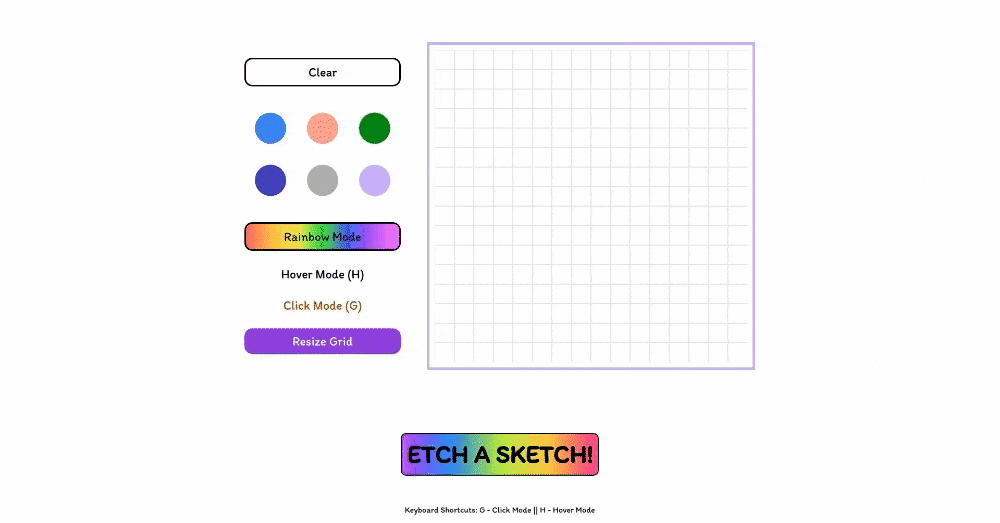
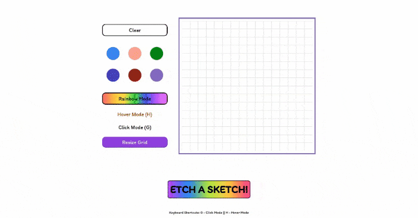

# OdinProjects-EtchASketch

Hey guys! This is my repository for the [Etch-A-Sketch project](https://www.theodinproject.com/lessons/foundations-etch-a-sketch)

Try it out [here](https://pauloomartin.github.io/OdinProjects-etchasketch/).

## Features
**Color Palette** - Want to draw something but are annoyed that you have not memorized the hexcode of your colors? The color palette got you. With color palettes, you can easily switch from color to color of your choice!

(unfortunately, the gif recorder cannot capture the part for changing colors)

**Rainbow Mode** - RAINBOWWWWWWWW

**Hover and Click Mode** - Adding colors has never been much easier. With click mode, you can choose specifically which cells you want to color. Hover mode, allows you to color just by hovering your mouse over the canvas. Try it! (Keyboard shortcuts are available.)

## Notes
I had complete fun with this one. I had to speed up development though; I got a little impatient. I went with the craftsman approach, meticulously thinking about and implementing each step and thinking of errors that could possibly arise. It was a difficult project, but I am pleased with the results :D